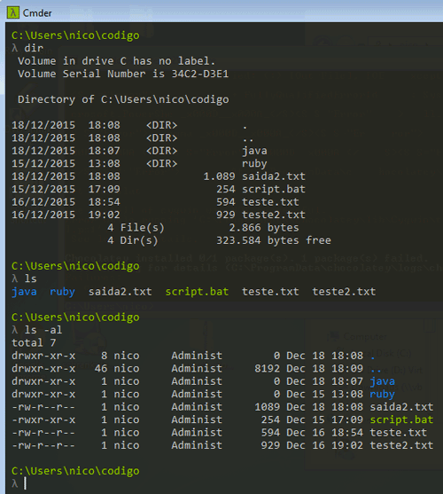

# Instalação do Vagrant

Primeiro passo é instalar o VirtualBox. Para isso baixe da página oficial a versão para Windows/Linux/MacOS. O curso foi testado com a versão 5.x do VirtualBox. Segue o link do download:

* [VirtualBox](https://www.virtualbox.org/wiki/Downloads)

Faça o download e instale o VirtualBox!

### Instalação do Vagrant

Vagrant é a nossa ferramenta para controlar o VirtualBox e definir a maquina virtual. Testamos o curso com Vagrant 2.x. Segue o link para baixar, escolhe a versão para seu sistema operacional:

* [Vagrant](https://www.vagrantup.com/downloads.html)

Da mesma forma, faça o download e instale o Vagrant!

*Obs: Pode ser necessário reiniciar o Windows após a instalação do Vagrant.*

### Definição da VM:

Crie um diretório e dentro delee crie o arquivo `Vagrantfile` com uma `config` inicial:

````
Vagrant.configure("2") do |config|

end
````

Dentro do `config` adicione o nosso box `hashicorp/precise2`: 

[*Aqui será definido qual o sistema operacional você vai utilizar, para saber mais clique aqui.*](https://www.vagrantup.com/docs/boxes)

```
config.vm.box = "hashicorp/precise32"
```

e defina uma maquina virtual (VM) `web` com o `private_network`:

```
config.vm.define :web do |web_config|
        web_config.vm.network "private_network", ip: "192.168.50.10"
end
```

Salve o arquivo.

No terminal, no diretório que você criou (onde está o `Vagrantfile`) rode a máquina virtual (VM) com o Vagrant:

```
vagrant up
```

A primeira execução pode demorar alguns minutos dependendo da sua conexão.

Após instalação, verifique o status da sua VM usando o comando:

```
vagrant status
```

Para parar a VM você pode usar: 

```
vagrant halt
```

Segue o arquivo `Vagrantfile`:

```
Vagrant.configure("2") do |config|

    config.vm.box = "hashicorp/precise32"

    config.vm.define :web do |web_config|
            web_config.vm.network "private_network", ip: "192.168.50.10"
    end
end
```

### Conectar à VM com Windows

Para acessar e se comunicar com a maquina virtual usaremos o SSH (Secure Shell). Esse cliente SSH também é o padrão do Vagrant, mas infelizmente ainda não é tão bem integrado no Windows (mas isso está mudando).

Para usar SSH no Windows existem 3 opções:

* Pelo Cliente nativo
* Pelo `cmder`
* Pelo programa Putty

**Aconselhamos tentar primeiro o cliente nativo, caso não funcione usar o `cmder` e no ultimo caso Putty que é mais burocrático.**

### Windows com cliente ssh nativo

As versões mais recente do Windows já tem um cliente ssh. Para instalá-lo vá para Configurações -> Sistema -> Aplicativos e Recursos -> Gerenciar recursos opcionais -> Adicionar um recurso. Na lista, procure pelo cliente OpenSSH. Caso não encontrou o cliente OpenSSH tente usar o cmder explicado mais para baixo nesse exercício.

Para testar o cliente SSH, abra um terminal/prompt e entre na pasta musicjungle onde se encontra o nosso Vagrantfile. Garante que nosso VM está rodando:

```
vagrant up
```

E execute para se conectar à VM:

```
vagrant ssh
```

### Windows com cmder

O `cmder` é um terminal/prompt para Windows que vem com um monte de ferramentas do mundo Unix e do mundo de desenvolvimento. De grosso modo, usando `cmder` você tem quase um Bash/Shell instalado no seu Windows. Isso significa que a maioria dos comandos do mundo Bash/Shell vão funcionar! Entre os comandos que vem com `cmder` são o `ssh` e o `rsync` (o rsync usaremos no último capítulo).

### Instalação do cmder

O `cmder` pode ser baixado nesse site [clicando aqui](http://cmder.net/). Para ter acesso a todas as ferramentas **baixe a versão full**. Depois basta extrair o ZIP e rodar o executável cmder. Isso abra um novo terminal que você deve utilizar durante do curso:



A partir desse terminal entre no seu diretório e execute `vagrant up` (se não tiver rodando ainda). Uma vez inicializada a VM execute:

```
vagrant ssh
```

### Conectando com Putty

Garante que a VM está rodando (`vagrant up`). Ainda no terminal digite:

`vagrant ssh-config`

A saída deve mostrar algo assim:

```
C:\Users\alura\Documents\musicjungle>vagrant ssh-config
Host web
  HostName 127.0.0.1
  User vagrant
  Port 2222
  UserKnownHostsFile /dev/null
  StrictHostKeyChecking no
  PasswordAuthentication no
  IdentityFile C:/Users/alura/Documents/musicjungle/.vagrant/machines/web/virtualbox/private_key
  IdentitiesOnly yes
  LogLevel FATAL
```

A sua saída pode variar um pouco. Você precisa saber o `Hostname`, `Port` e `IdentityFile`.

Agora abra o programa Putty:

* Clique no lado esquerdo no item `Connection > SSH > Auth`.
* Clique no botão `Browse`
* Selecione o arquivo “private_key” que deve estar na pasta do seu projeto `C:/Usuarios/<seu usuario>/DevOps/Vagrant/.vagrant.d/machines\web\virtualbox/private_key` (aquele `IdentityFile`)
* Volte no lado esquerdo no item e salva a sessão para lembrar das configurações (por exemplo chame a sessão `vagrant`)
* Na mesma tela digite no campo `HostName` o usuário e endereço da nossa VM: vagrant@127.0.0.1
* A porta é no nossa caso `2222`
* Salve a sessão e clique em `Open` para abrir uma conexão com a maquina virtual
* A senha é `vagrant`

### Conectar à VM com Linux/Mac

Uma vez a nossa VM rodando vamos nos conectar a ela. Para tal devemos usar a ferramenta `ssh`. No MacOS e Linux a ferramenta `ssh` já está instalada por padrão, por isso basta executar (dentro da pasta onde está o Vagrantfile) o comando:

```
vagrant ssh
```

O vagrant automaticamente se conecta via `ssh` usando o usuário `vagrant` e a chave privada definida da pasta (`.vagrant`).

Para sair da VM basta digitar `exit` ou `logout`.

### ssh config

A chave privada se encontra no HOST na pasta

`.vagrant/machines/web/virtualbox/.`

Para listar mais detalhes sobre a configuração basta digitar no host:

```
vagrant ssh-config
```

# Ubuntu sem Puppet?

Se a sua versão do Ubuntu vem **sem o Puppet** instalado, use o *Shell Provisioner* para instalação automático. Repare a linha nova com `vm.provision "shell"`:

```
Vagrant.configure("2") do |config|
    config.vm.box = "hashicorp/precise32"
    config.vm.define :web do |web_config|
        web_config.vm.network "private_network", ip: "192.168.50.10"
        #novo
        web_config.vm.provision "shell", inline: "sudo apt-get update && sudo apt-get install -y puppet"
    end
end
```

No curso estamos usando a box "hashicorp/precise32" que é baseado no Ubuntu 12.04 32bit. Nessa imagem também já vem o Puppet instalado (normalmente) no entanto existem várias imagens que não vem com Puppet pre-instalado!

O que faremos nesse caso já que não podemos usar Puppet para instalar Puppet?

#### Instalar Puppet manualmente

Por exemplo, na distribuição CentOS (box centos/7), que também está disponível como box, não tem Puppet pre-instalado. Ou seja, o caminho "manual" seria criar o Vagrantfile com CentOS para depois instalar o Puppet na mão. Seriam esses dois comandos abaixo:

```
sudo rpm -ivh http://yum.puppetlabs.com/puppetlabs-release-el-7.noarch.rpm 
sudo yum install -y puppet
```

O CentOS usa rpm/yum como package manager da distribuição, baixamos o package para depois instalar com yum. Mas será que necessário executar cada comando manualmente? Será que não tem uma forma para o Vagrant enviar esses comandos à VM na criação? Claro que tem e vamos usar o Shell Provisioner para tal.

### Shell Provisioner

Segue o `Vagrantfile` que define o CentOS7 e já instala o Puppet na hora:

```
Vagrant.configure("2") do |config|

    config.vm.define "cent7" do |cent_config|
        cent_config.vm.box = "centos/7"
        cent_config.vm.network "private_network", ip: "192.168.50.11"
        cent_config.vm.provision "shell", inline: <<-SHELL
              sudo rpm -ivh http://yum.puppetlabs.com/puppetlabs-release-el-7.noarch.rpm
              sudo yum install -y puppet
        SHELL
    end
end
```

Repare a configuração `cent_config.vm.provision "shell"` que contem os dois comandos inline. Ao executar e subir a VM:

```
vagrant up
```

Já será executado o **Shell Provisioner** que envia os comando para a VM. Assim já temos o Puppet instalado e podemos usá-lo como nosso provisionador. O legal é que podemos usar o *Shell Provisioner* para executar qualquer script, por exemplo:

```
cent_config.vm.provision "shell", path: "manifests/init_puppet.sh"
```

e o scrip:

```
#!/bin/sh

sudo rpm -ivh http://yum.puppetlabs.com/puppetlabs-release-el-7.noarch.rpm 
sudo yum install -y puppet
```

# Provisioning com Puppet

1) Primeiro vamos parar e destruir a nossa máquina. Caso não tenha feito ainda, execute na pasta onde tem o Vagrantfile:

```
vagrant halt
vagrant destroy
```

Agora é a hora de automatizarmos a instalação do Tomcat.

2) Na pasta `Vagrant` (onde tem o `Vagrantfile`) crie um novo diretório chamado `manifests`.

3) No diretório manifests crie um arquivo chamado `web.pp`. Neste nosso script do Puppet coloque a configuração para executar um `apt-get update`:

```
exec { "apt-update":
  command => "/usr/bin/apt-get update"
}
```

4) Ainda no `web.pp` coloque o pedido de instalação do pacote do Java 7 e do Tomcat:

```
package { ["openjdk-7-jre", "tomcat7"]:
    ensure => installed,
    require => Exec["apt-update"]
}
```

5) Inicie uma nova máquina com:

```
vagrant up
```

Vai demorar um pouco para executar, então não se preocupe se nada parecer acontecer por alguns minutos.

6) Uma vez criada, se conecte através do comando vagrant ssh (ou Putty) e execute o comando do Puppet abaixo:

```
sudo puppet apply /vagrant/manifests/web.pp
```

### (Opcional) Um novo pacote

Execute o comando apt-cache search nome-de-um-programa e escolha um programa simples que gostaria de instalar, como por exemplo o unzip. Verifique que ele não está instalado e então adicione ao seu script do puppet e faça a instalação dele através do mesmo. Utilize um projeto simples como o unzip

Para instalar um novo pacote você pode usar o comando `package` do puppet:

```
package { 'unzip':
  ensure => installed,
  require => Exec["apt-update"]
}
```